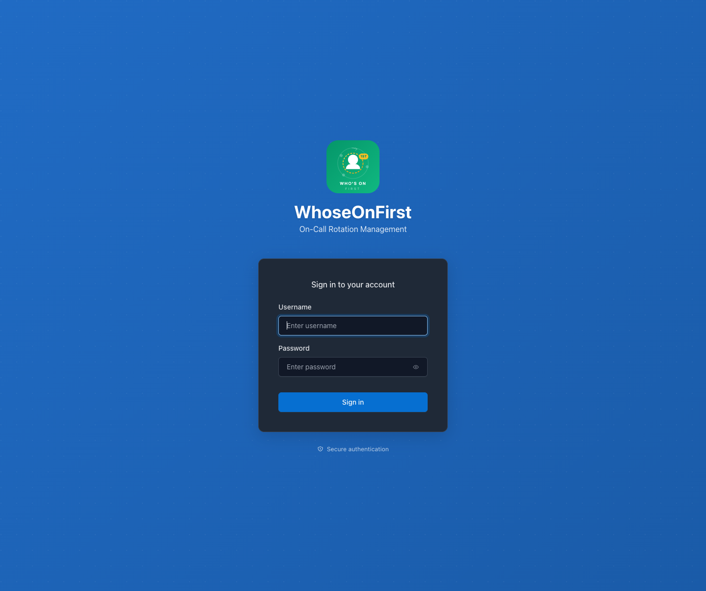
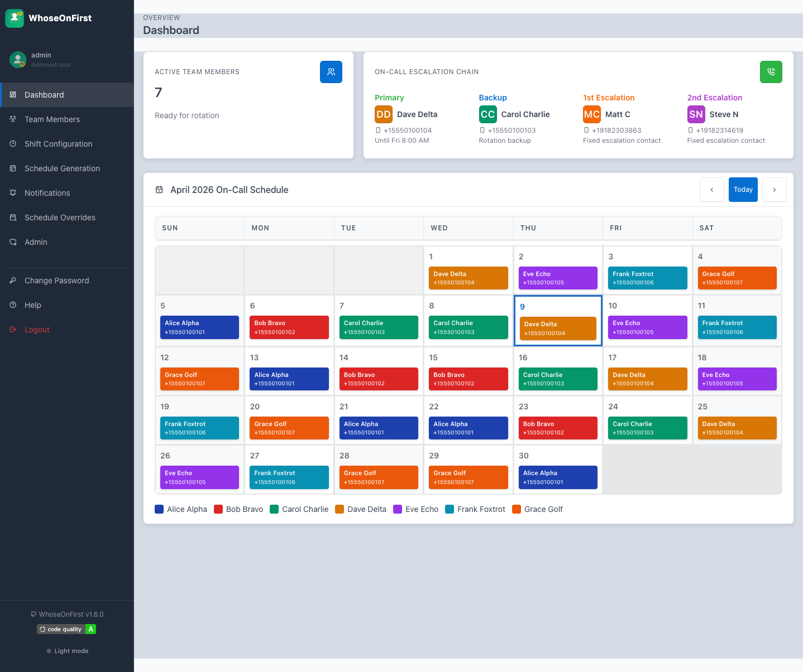
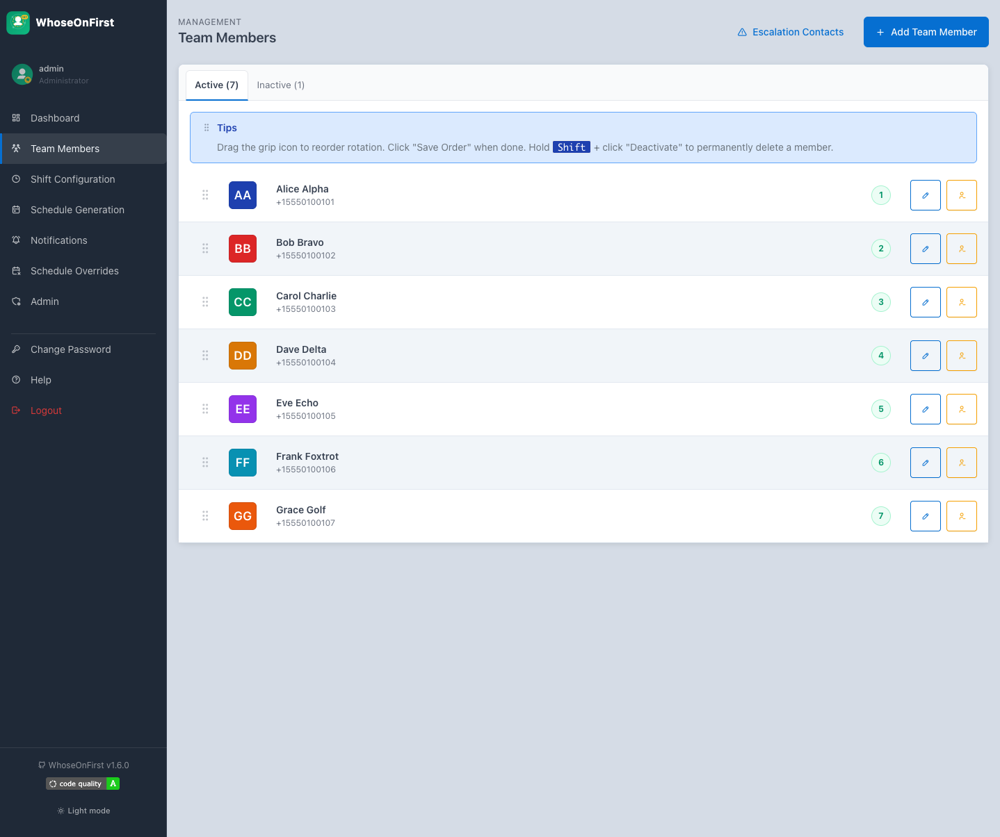
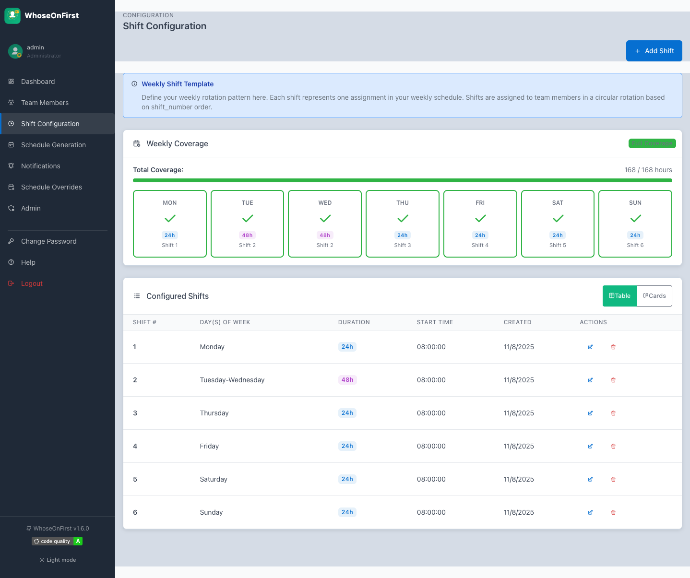
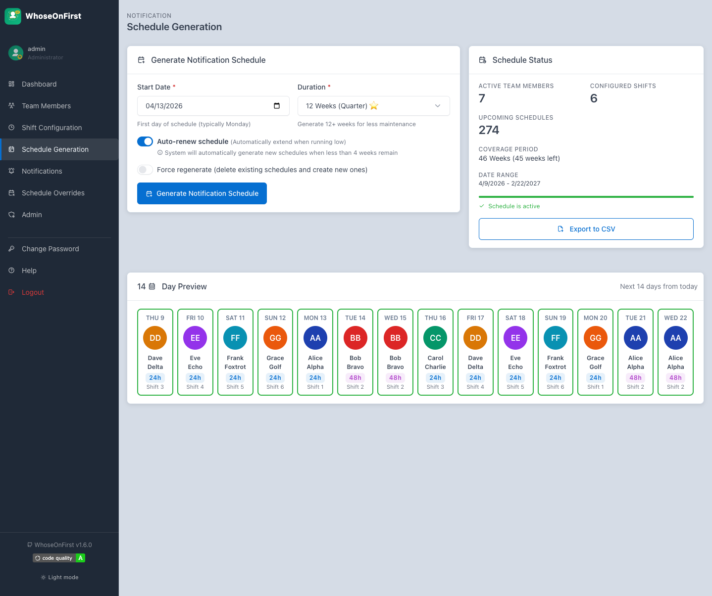
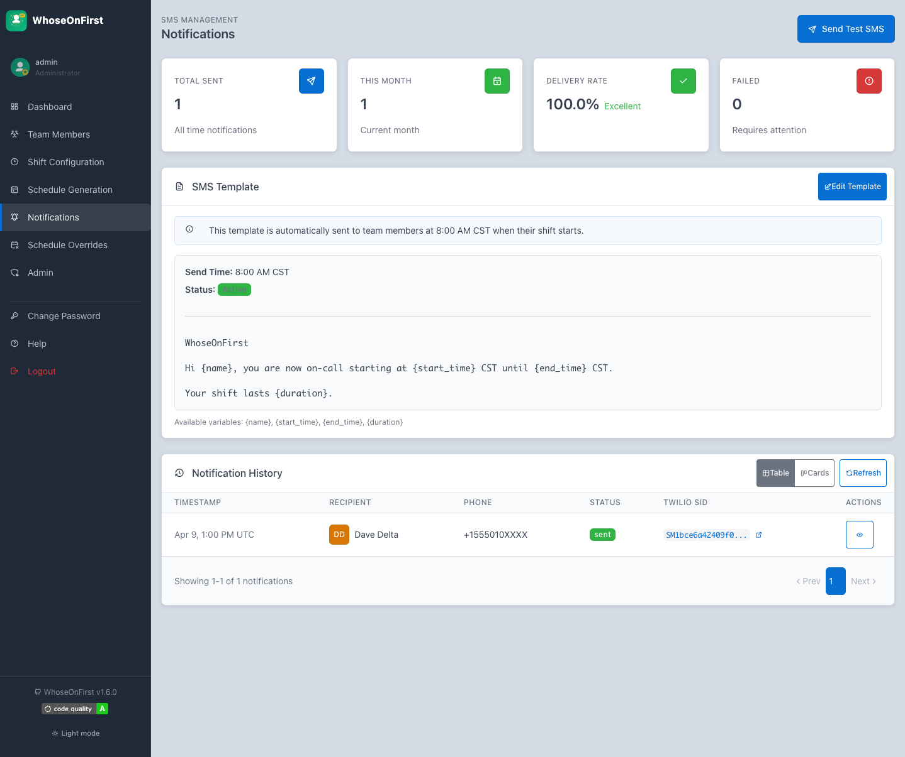
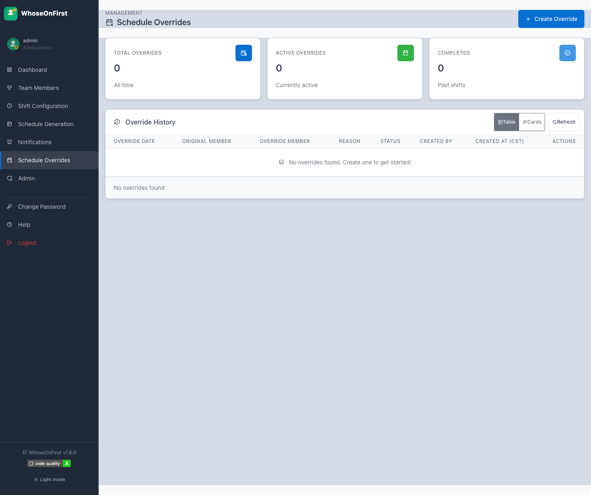
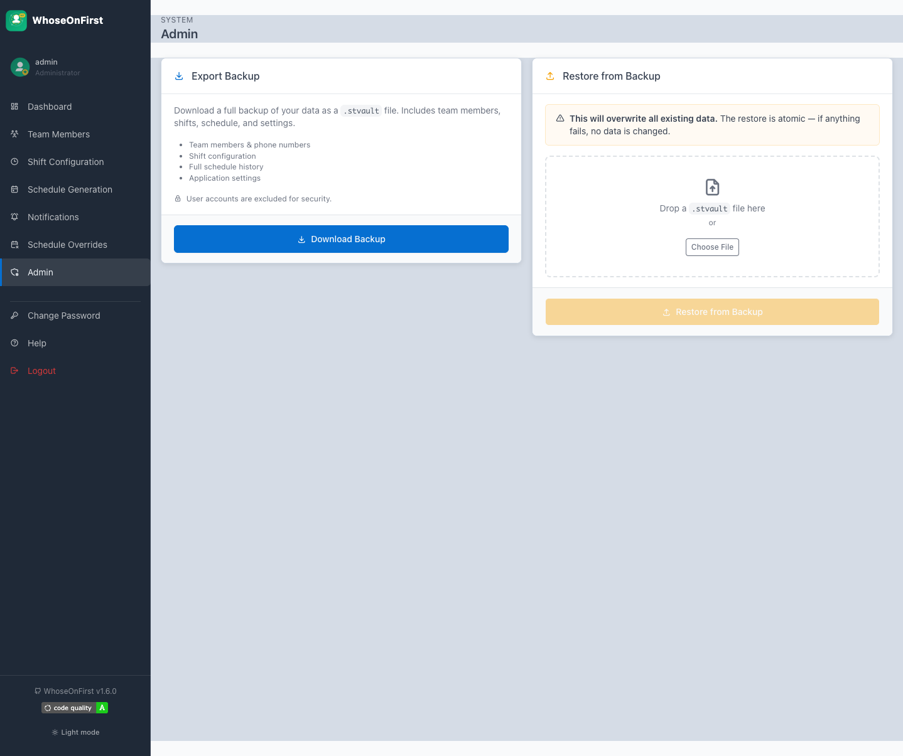

<p align="center">
  
</p>

<p align="center">
  <strong>Automated on-call rotation and SMS notification system</strong>
</p>

<p align="center">
  <a href="https://www.python.org/"></a>
  <a href="https://fastapi.tiangolo.com/"></a>
  <a href="CHANGELOG.md"></a>
  <a href="https://app.codacy.com/gh/lbruton/WhoseOnFirst/dashboard"></a>
</p>

---

WhoseOnFirst manages shift assignments and sends daily SMS notifications to on-call team members. The system uses a circular rotation algorithm to ensure fair, predictable shift distribution.

## Features

- **Role-based access control** &mdash; Admin and Viewer roles with session-based authentication
- **Configurable shifts** &mdash; 24-hour and 48-hour shifts with flexible day assignments
- **Automated SMS** &mdash; Daily 8:00 AM CST notifications via Twilio with customizable templates
- **Schedule overrides** &mdash; Manual coverage swaps for vacation, sick leave, or on-demand changes
- **Drag-and-drop ordering** &mdash; Reorder rotation priority with a simple drag interface
- **Data portability** &mdash; Full backup/restore for migration between environments

---

## Screenshots

### Login

Secure session-based authentication with admin and viewer roles.

<p align="center">
  
</p>

### Dashboard

At-a-glance view of who's on call today, the escalation chain, and a color-coded monthly calendar showing the full rotation.

<p align="center">
  
</p>

### Team Members

Manage the on-call roster. Each member gets a unique color for calendar visibility. Drag the grip icon to reorder rotation priority.

<p align="center">
  
</p>

### Shift Configuration

Define your weekly shift template. Each shift maps to a day (or days for 48-hour doubles). The coverage chart shows gaps at a glance.

<p align="center">
  
</p>

### Schedule Generation

Generate rotation schedules weeks in advance. Auto-renew keeps the schedule rolling. Export to CSV for offline reference.

<p align="center">
  
</p>

### Notifications

SMS notification history with delivery status tracking. Customize the message template with dynamic placeholders for name, date, and time.

<p align="center">
  
</p>

### Schedule Overrides

Swap coverage for vacation or sick days without disrupting the rotation. Override history tracks who covered for whom and why.

<p align="center">
  
</p>

### Admin

Export a full database backup or restore from a previous backup. The restore is atomic &mdash; if anything fails, no data is changed.

<p align="center">
  
</p>

---

## Technology Stack

| Component | Technology |
|-----------|------------|
| Backend | FastAPI, Python 3.12 |
| Database | SQLite with SQLAlchemy ORM |
| Scheduler | APScheduler |
| SMS | Twilio |
| Frontend | Vanilla JS, Tabler CSS |
| Container | Red Hat UBI9 (OpenShift compatible) |

## Quick Start

```bash
# Clone and start
git clone <repo-url>
cd WhoseOnFirst
docker-compose up -d

# Access at http://localhost:8000
# Default admin: admin / Admin123!
# Default viewer: viewer / Viewer123!
```

*Change passwords immediately after first login.*

---

## Acknowledgments

- [FastAPI](https://fastapi.tiangolo.com/) &mdash; Web framework
- [Twilio](https://www.twilio.com/) &mdash; SMS delivery
- [Tabler](https://tabler.io/) &mdash; UI components

---

*Version 1.6.1 &middot; [Changelog](CHANGELOG.md)*
